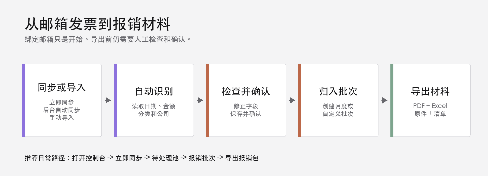
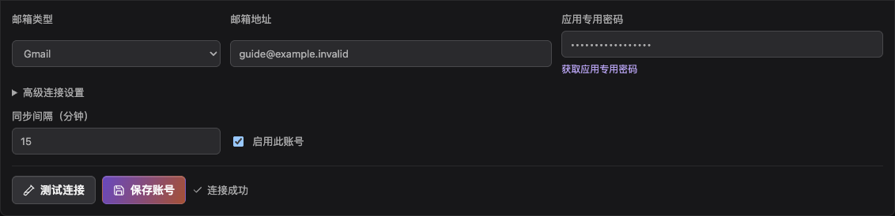
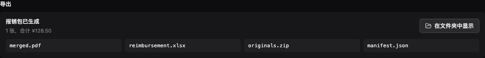

# 发票报销快速入门

> 适用版本：v0.2.6
> 适用电脑：Apple Silicon Mac（M1 或更新芯片）
> 适用系统：macOS 11 或更高版本
> 更新日期：2026-09-19

## 先了解这件事

设置并启用邮箱后，你只需创建月份或自定义批次，App 就能在界面内自动扫描邮件、识别票据、排除不确定项并生成报销包。不需要 Codex、Agent 或其他外部自动化工具。

## 1. 安装与绑定

1. 从分享者处获取 `invoice-reimbursement-0.2.6-macos-arm64.dmg`，打开后将《发票报销》拖入“应用程序”。
2. 第一次打开时，如果 macOS 阻止运行，在 Finder 中右键点击 App，选择“打开”，再次确认“打开”。也可在“系统设置 -> 隐私与安全性”中选择“仍要打开”。
3. 进入 App 的“设置”页，选择 Gmail 或 QQ 邮箱。
4. 输入邮箱地址和应用专用密码或授权码。这不是你平时登录邮箱的密码。
5. 保持“启用此账号”开启，点击“测试连接”。看到“连接成功”后，点击“保存账号”。

应用专用密码或授权码只保存在 macOS 钥匙串中，不要把它写入文档、截图或聊天记录。

<!-- pagebreak -->

## 2. 创建自动批次

1. 打开“报销批次”，点击“新建批次”。
2. 按自然月报销时选择“按月”，设置年份和月份。
3. 需要跨月或精确日期时选择“自定义范围”，设置开始和结束日期。
4. 保留默认勾选的“创建后自动处理并导出”。
5. 点击“创建并自动处理”。

创建后会进入批次详情，页面显示“正在自动处理”。App 会扫描所有已启用邮箱在该日期范围内的邮件，完成识别、安全审核、归属和导出。

按月批次的月份对应邮箱收件月份。例如，创建 8 月批次后，App 会抓取邮箱在 8 月 1 日至 8 月 31 日收到的发票邮件；邮件中的开票日期即使是 7 月，也仍按 8 月批次处理。手动上传文件则按发票开票日期归属。

### 邮件中的原件链接

同步时，App 不仅检查附件，也检查正文中的 HTTPS 链接。符合安全规则并通过文件类型校验的 PDF、JPEG、PNG 或 ZIP 发票原件会自动下载；支持的诺诺短链接会先解析到真实 PDF。XML 配套链接和不直接指向发票原件的通用 `fp.nuonuo.com/#/` 首页会被忽略。

链接临时失败会作为异常项保持可见；恢复网络后，重新运行原批次，或新建覆盖邮件日期的批次即可重试，不会重复导入已成功下载的原件。“立即同步”不会回看同步游标之前的旧邮件。需要登录或依赖脚本的门户若不受支持，也会保留为可见异常，不会中断后续发票或邮箱。并非支持所有发票门户。所有处理都在《发票报销》App 内完成。

### 邮件台账：确认没有漏票

“邮件台账”按邮件逐封列出结果：“已提取”表示发票都进来了，“部分提取”“未提取”“需关注”需要你展开看一眼失败原因（链接下载失败、压缩包加密、格式不支持等）。“无需处理”是通知类邮件，不会产生票据。

“运行设置”里的“发票全部提取完成后标记邮件为已读”默认开启：一封邮件的发票全部导入成功后，App 才会在邮箱里把它标记为已读。

<!-- pagebreak -->

## 3. 批次与导出

1. 等待页面显示“自动处理完成”。
2. 检查新导入、已自动纳入、异常项和失败邮箱的数量。
3. 异常项为 0 且张数、金额和分类正确时，点击“在文件夹中显示”打开导出目录。
4. 只有异常项不为 0 或结果不对时，才进入“待处理池”。处理重复、修正识别值，点击“保存并确认”，然后回到原批次点击“再次自动处理”。
5. 一批票据结果都正确时，可以在批次详情勾选后点“确认所选票据”批量确认，或点“清空待确认（N）”一次确认剩余票据；点“移出所选票据”只是移出批次，不会删除票据。

疑似重复、OCR 识别不完整、文件损坏或读取异常、以及已归属其他批次的票据都会被排除，不会被默默纳入或导出。PDF、链接下载件和 ZIP 内副本的关键发票字段一致时，App 只保留第一条主记录。

导出目录中应有四个文件：

- `merged.pdf`：合并后的发票 PDF。
- `reimbursement.xlsx`：报销明细表。
- `originals.zip`：原始票据压缩包。
- `manifest.json`：本次导出的清单与校验信息。

## 遇到问题

先试这一招：在「运行设置」点「导出诊断包」，它会把版本、数据库计数、最近同步记录、邮件台账摘要和一致性统计打包成一个 zip（不含授权码与发票内容），排查时一眼就能看出卡在哪一步。

- **点击“立即同步”后没有发票**：确认账号已启用，邮件中有受支持的附件或可直接获取的 HTTPS 发票原件链接，并查看“待处理池”的“全部”标签和异常项。
- **没有可导出票据**：App 不会生成空报销包。检查批次日期和异常项，修正后再次自动处理。
- **所有邮箱失败**：页面会显示“自动处理未完成”和“所有已启用邮箱同步失败”，不会继续归属票据、导出可能不完整的报销包或把失败显示为完成。已抓取的部分数据会保留。恢复网络或更新授权码，在设置中重新“测试连接”并保存，然后在原批次点击“重试自动处理”。
- **导出失败**：已纳入票据仍保留在批次中。恢复可写的导出目录或外接盘后重试，不要手动删除临时文件。
- **关闭窗口后找不到 App**：主窗口只是被隐藏。在 macOS 菜单栏找到《发票报销》图标，选择“显示发票报销”。

**安全与校验：** 当前分享版采用 ad-hoc（临时）签名并启用了 Hardened Runtime，未使用 Apple Developer ID 签名，也未经过 Apple 公证。只从可信分享者处获取安装包，不要关闭 Gatekeeper。分享者应同时提供 `invoice-reimbursement-0.2.6-macos-arm64.dmg.sha256`；将它和 DMG 放在同一目录，在终端运行 `shasum -a 256 -c invoice-reimbursement-0.2.6-macos-arm64.dmg.sha256`，结果应显示 `OK`。

更多说明请查看《发票报销完整用户手册》。

本快速入门对应《发票报销》v0.2.6，更新日期为 2026-09-19。请以当前版本随附文档为准。
