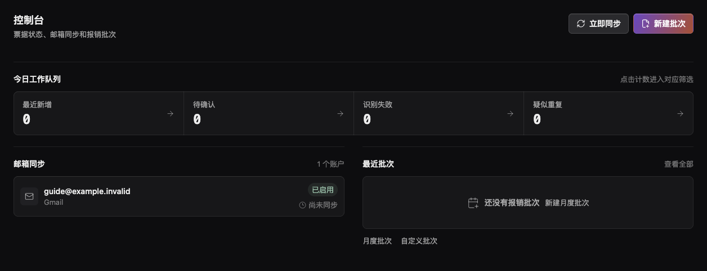
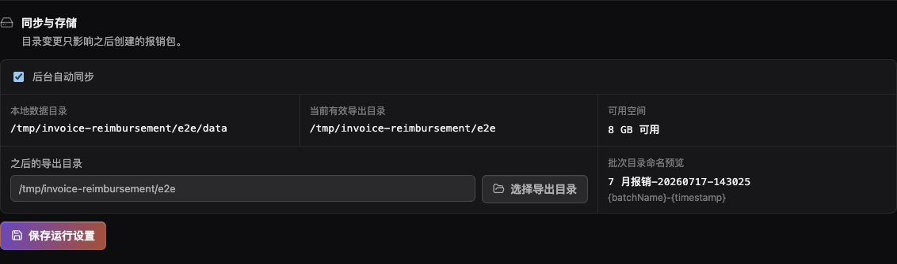
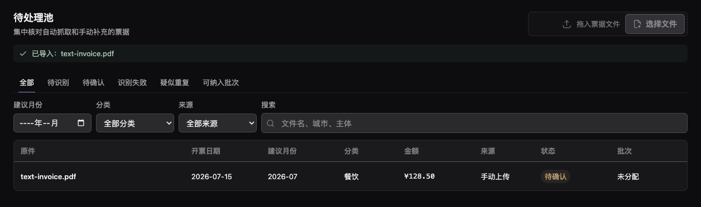
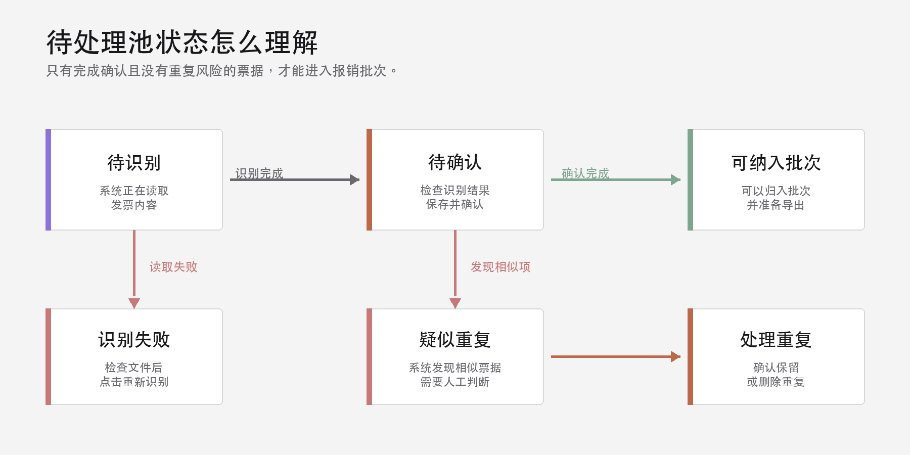
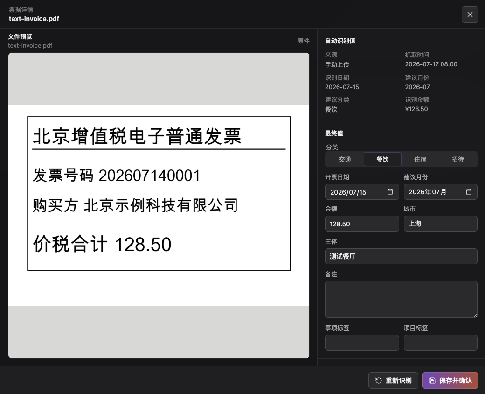
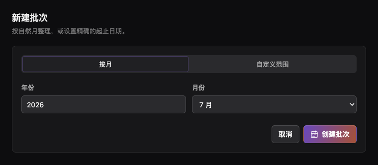

# 发票报销完整用户手册

> 文档版本：1.0
> 适用 App 版本：v0.1.0
> 更新日期：2026-07-20

## 关于本手册

本手册帮助你在 Mac 上安装《发票报销》，绑定 Gmail 或 QQ 邮箱，将发票同步到本地，检查识别结果，并导出一份可用于报销的材料包。

如果你只想尽快完成第一次报销，请先阅读《发票报销快速入门》。

### 最重要的工作原则

**绑定邮箱不等于 App 已经替你完成报销。** App 会收集邮件附件并尝试识别发票，但你仍需要检查识别结果、确认票据、归入报销批次，最后手动导出。

---

## 1. 开始之前

### 1.1 系统要求

| 项目 | 要求 |
|---|---|
| Mac 芯片 | Apple Silicon，即 M1、M2、M3、M4 或更新芯片 |
| macOS | macOS 11 或更高版本 |
| App 版本 | v0.1.0 |
| 安装包 | `发票报销_0.1.0_aarch64.dmg` |
| 邮箱 | Gmail 或 QQ 邮箱 |

当前安装包不支持 Intel Mac。如果你不确定芯片类型，打开 macOS 左上角苹果菜单，选择“关于本机”查看“芯片”。

### 1.2 当前分享版的安全提醒

v0.1.0 是用于本地分享的未签名 macOS 安装包，没有经过 Apple 签名和公证。macOS 第一次打开时可能会阻止运行。

- 只从你信任的分享者处获取安装包。
- 不要为了运行本 App 关闭 Gatekeeper 或 macOS 的整体安全保护。
- 官方分享包的 SHA-256 应为：

`221da96e640426824a3d6673d9e90080302f0edd4fce45fb856d5e74a8e111b3`

熟悉终端的用户可以执行：

~~~bash
shasum -a 256 发票报销_0.1.0_aarch64.dmg
~~~

输出必须与上面的完整字符串一致。

### 1.3 本地优先与数据边界

发票文件、识别结果、批次和导出包都在当前 Mac 上处理与保存。App 通过你配置的 IMAP 邮箱连接读取新邮件附件。邮箱应用专用密码或授权码由 macOS 凭据存储管理，不应写入文档、截图或聊天记录。

---

## 2. 下载、安装与首次打开

### 2.1 安装 App

1. 从分享者处获取 DMG 文件。
2. 双击 DMG 打开安装镜像。
3. 将《发票报销》拖入“应用程序”文件夹。
4. 等待复制完成，然后退出 DMG。

### 2.2 处理“无法验证开发者”

优先使用这种方法：

1. 在 Finder 的“应用程序”中找到《发票报销》。
2. 右键点击 App，选择“打开”。
3. 在再次出现的提示中选择“打开”。

如果没有“打开”选项：

1. 打开“系统设置 -> 隐私与安全性”。
2. 向下滚动，找到与《发票报销》相关的阻止记录。
3. 点击“仍要打开”，完成 macOS 验证。

### 2.3 确认首次打开成功

成功打开后，左侧应看到“控制台”“待处理池”“报销批次”和“设置”四个入口。首次使用时，控制台的邮箱账号和票据数量可以为空。

---

## 3. 认识发票报销 App

| 页面 | 主要用途 | 最常用的操作 |
|---|---|---|
| 控制台 | 查看当前队列、邮箱状态和最近批次 | 立即同步、进入待确认、新建批次 |
| 待处理池 | 检查自动抓取和手动导入的票据 | 筛选、修正、重新识别、保存并确认 |
| 报销批次 | 按月或日期范围整理发票 | 创建批次、调整票据、导出报销包 |
| 运行设置 | 管理邮箱、后台同步和存储 | 测试邮箱、保存账号、更改导出目录 |

控制台的“最近新增”“待确认”“识别失败”和“疑似重复”都可以点击。点击后会进入带对应筛选条件的待处理池。

---

## 4. 绑定 Gmail 或 QQ 邮箱

### 4.1 不要输入普通登录密码

Gmail 需要“应用专用密码”，QQ 邮箱需要“授权码”。它们是为第三方邮件客户端生成的单独凭据，不是日常登录密码。

在 App 内，Gmail 会显示“获取应用专用密码”，QQ 邮箱会显示“获取邮箱授权码”。这两个按钮会打开邮箱服务商的帮助页。

### 4.2 Gmail 设置

1. 打开“设置 -> 邮箱账号”。
2. 邮箱类型选择 Gmail。
3. 输入完整 Gmail 地址。
4. 点击“获取应用专用密码”，按 Google 帮助页启用所需账号安全设置并生成密码。
5. 将生成的应用专用密码输入 App。
6. 默认 IMAP 服务器应为 `imap.gmail.com`，端口为 `993`。一般不需要改动高级连接设置。
7. 确认“启用此账号”已开启，同步间隔位于 5-1440 分钟之间。
8. 点击“测试连接”。看到“连接成功”后，点击“保存账号”。

### 4.3 QQ 邮箱设置

1. 打开“设置 -> 邮箱账号”。
2. 邮箱类型选择 QQ 邮箱。
3. 输入完整 QQ 邮箱地址。
4. 点击“获取邮箱授权码”，按 QQ 邮箱帮助页开启所需服务并生成授权码。
5. 将授权码输入 App 的“应用专用密码”字段。
6. 默认 IMAP 服务器应为 `imap.qq.com`，端口为 `993`。
7. 确认账号已启用，点击“测试连接”。看到“连接成功”后，点击“保存账号”。

### 4.4 修改已保存的账号

已保存账号的密码字段会显示“留空以保留钥匙串中的密码”。如果你只修改同步间隔，可以留空。如果更换了授权码，请输入新凭据，重新“测试连接”后再保存。

---

## 5. 让 App 开始处理发票

这是绑定邮箱后最关键的一章。你可以用三种方式将票据送入待处理池。

### 5.1 方式一：点击“立即同步”

1. 进入“控制台”。
2. 确认“邮箱同步”区域中显示已保存且已启用的账号。
3. 点击右上角“立即同步”。
4. 等待同步完成。App 会依次处理所有已启用的邮箱账号。
5. 查看“最近新增”“待确认”“识别失败”和“疑似重复”的数量变化。
6. 点击对应数字或打开“待处理池”开始检查。

“立即同步”只处理已启用账号。如果按钮不可用，请回到“设置”，确认账号已保存且“启用此账号”已开启。

### 5.2 方式二：后台自动同步

1. 打开“设置 -> 同步与存储”。
2. 开启“后台自动同步”。
3. 在邮箱账号中设置同步间隔，可选范围为 5-1440 分钟。
4. 点击“保存运行设置”。

关闭主窗口后，App 会隐藏到 macOS 菜单栏，而不是直接退出。只要没有从菜单栏选择“退出”，后台自动同步仍可继续运行。

### 5.3 方式三：手动导入

1. 打开“待处理池”。
2. 将票据文件拖到“拖入票据文件”区域，或点击“选择文件”。
3. 等待页面显示“已导入”。
4. 在表格中点击新文件开始检查。

每个文件最大 50 MB。当前可导入 PDF、JPG、JPEG、PNG、DOC、DOCX、XLS、XLSX 和 ZIP。为获得最稳定的预览与识别结果，优先使用清晰的 PDF、JPG 或 PNG。

### 5.4 同步后会发生什么

App 会将新票据保存到本地，计算文件摘要，尝试读取发票内容，并生成建议日期、月份、分类、金额、城市和公司主体。同一邮件附件通常不会在每次同步时重复导入；内容高度相似的票据仍可能进入“疑似重复”，由你判断。

---

## 6. 在待处理池检查发票

### 6.1 五种状态

| 状态 | 含义 | 你要做什么 |
|---|---|---|
| 待识别 | App 正在读取文件或等待识别 | 稍后刷新或等待自动完成 |
| 待确认 | 已有识别结果，但尚未人工确认 | 打开票据，检查后“保存并确认” |
| 识别失败 | 文件无法正常读取或内容不足 | 检查原件，必要时更换清晰文件，再“重新识别” |
| 疑似重复 | App 发现了内容相似的票据 | 核对后选择“确认保留”或“删除重复” |
| 可纳入批次 | 票据已确认且没有未处理的重复风险 | 将它归入报销批次 |

### 6.2 打开票据详情

点击票据列表中的文件名。右侧会打开“票据详情”，包含：

- 原件预览。
- 自动识别值。
- 可编辑的最终值。
- 批次归属。
- 重新识别和保存按钮。

### 6.3 逐项检查最终值

| 字段 | 检查重点 |
|---|---|
| 分类 | 从交通、餐饮、住宿、招待中选择正确类别 |
| 开票日期 | 必须与发票原件一致 |
| 建议月份 | 决定发票更适合进入哪个月度批次 |
| 金额 | 使用元为单位，最多两位小数 |
| 城市 | 核对交易或开票城市 |
| 主体 | 核对商户、销售方或公司名称 |
| 备注 | 填写特殊说明，可留空 |
| 事项标签 | 标记会议、差旅等事项，可留空 |
| 项目标签 | 标记内部项目，可留空 |

检查完成后点击“保存并确认”。如果金额或月份不符合要求，App 会在字段附近显示错误，修正后再保存。

### 6.4 使用筛选和搜索

待处理池支持按状态、建议月份、分类、来源和关键词筛选。如果你从控制台的“最近新增”进入，页面可能带有“最近 7 天”筛选。可以点击“清除最近 7 天筛选”查看更早票据。

---

## 7. 处理识别失败和疑似重复

### 7.1 识别失败

1. 点击“识别失败”标签。
2. 打开票据，查看原件预览和提示。
3. 确认文件不是空文件，图片清晰且未损坏。
4. 点击“重新识别”。
5. 如果仍然失败，优先获取更清晰的 PDF 或图片，再手动导入。

识别失败的票据不能归入批次。

### 7.2 疑似重复

1. 点击“疑似重复”标签。
2. 对照发票号、日期、金额、公司和原件内容。
3. 如果两张确实是不同票据，点击“确认保留”。
4. 如果是重复文件，点击“删除重复”。

删除会移除该重复项。操作前请先确认已有一份正确票据被保留。未处理的疑似重复票据不能归入批次。

---

## 8. 创建和管理报销批次

### 8.1 创建批次

1. 打开“报销批次”。
2. 点击“新建批次”。
3. 按自然月报销时选择“按月”，设置年份和月份。
4. 需要跨月或指定精确日期时选择“自定义范围”，设置开始日期和结束日期。
5. 点击“创建批次”。

### 8.2 将票据归入批次

进入批次详情后，有两种常用方法：

- 点击“加入推荐票据”，将日期范围与状态符合的票据加入。
- 点击“调整票据”，在对话框中选择票据，然后点击“归属所选票据”。

日期不在批次范围内的票据会显示范围提示，操作前应重新核对建议月份和批次日期。识别失败和疑似重复的票据不可归入。

### 8.3 导出前检查

在批次详情顶部检查：

- 票据张数是否正确。
- 合计金额是否与预期一致。
- 交通、餐饮、住宿和招待分类汇总是否正确。
- “待确认”是否为 0。

批次中只要存在未确认票据，App 就会阻止导出。回到待处理池打开该票据，完成“保存并确认”后再导出。

---

## 9. 导出报销材料

### 9.1 导出步骤

1. 打开已整理完成的批次。
2. 确认待确认为 0。
3. 点击“导出报销包”。
4. 等待页面显示“报销包已生成”。
5. 点击“在文件夹中显示”打开导出目录。

### 9.2 导出包内容

| 文件 | 用途 |
|---|---|
| `merged.pdf` | 将批次内发票整理为一份合并 PDF |
| `reimbursement.xlsx` | 报销明细表，包含发票字段和分类信息 |
| `originals.zip` | 批次中的原始票据文件归档 |
| `manifest.json` | 导出清单、文件信息和校验用元数据 |

一般分享给财务人员时，优先提供 `merged.pdf` 和 `reimbursement.xlsx`；需要原件核验或归档时，再提供 `originals.zip` 和 `manifest.json`。

### 9.3 更改导出目录

1. 打开“设置 -> 同步与存储”。
2. 在“之后的导出目录”旁点击“选择导出目录”。
3. 选择一个当前用户可写入的本地文件夹。
4. 点击“保存运行设置”。

目录变更只影响之后创建的报销包，不会自动移动已导出的包。如果选择了外接硬盘，导出时必须确保该硬盘已连接且可写。

---

## 10. 后台运行、数据目录与备份

### 10.1 关闭主窗口不等于退出

点击主窗口左上角的关闭按钮时，App 会隐藏窗口并继续保留在 macOS 菜单栏。菜单栏菜单提供：

- “显示发票报销”：重新打开主窗口。
- “立即同步全部”：同步所有已启用账号。
- “退出”：完全关闭 App。

当开启后台自动同步时，不要在希望 App 继续抓取邮件时选择“退出”。

### 10.2 本地数据目录

App 主数据目录为：

`~/Library/Application Support/com.invoice-desk.desktop/`

这个目录中包含数据库、票据原件、处理后文件和运行状态。正常使用中不要手动删除或重命名其中的文件。

### 10.3 备份

1. 从 macOS 菜单栏的 App 菜单选择“退出”。
2. 在 Finder 中选择“前往 -> 前往文件夹”。
3. 输入 `~/Library/Application Support/`。
4. 将整个 `com.invoice-desk.desktop` 文件夹复制到安全的备份位置。
5. 同时备份你设置的外部导出目录。

邮箱应用专用密码或授权码保存在 macOS 凭据存储中，不会因为复制数据目录而自动备份。迁移到另一台 Mac 后可能需要重新输入授权码。

### 10.4 卸载

将 App 从“应用程序”移到废纸篓不会自动删除本地数据目录、导出包或 macOS 凭据存储中的凭据。需要完全清理时，请先备份必要资料，再由熟悉 macOS 数据管理的人员处理。

---

## 11. 常见问题

### 11.1 macOS 阻止首次打开

**检查：** 确认安装包来自信任的分享者，并核对版本和 SHA-256。
**处理：** 在 Finder 中右键点击 App 后选择“打开”，或在“系统设置 -> 隐私与安全性”中选择“仍要打开”。不要全局关闭 Gatekeeper。

### 11.2 邮箱“测试连接”失败

**检查：** 邮箱类型、完整邮箱地址、应用专用密码或授权码、IMAP 地址和端口。
**处理：** 重新生成授权码并输入。Gmail 默认使用 `imap.gmail.com:993`，QQ 默认使用 `imap.qq.com:993`。确认网络可用后再次测试。

### 11.3 点击“立即同步”后没有发票

**检查：** 账号是否已启用，邮件是否实际包含受支持的附件，该附件是否以前已同步。
**处理：** 打开“待处理池 -> 全部”，清除月份、分类、来源、搜索和“最近 7 天”筛选。再次同步，或将附件下载后手动导入。

### 11.4 附件识别失败

**检查：** 文件是否为空，图片是否清晰，PDF 是否能正常打开，文件是否超过 50 MB。
**处理：** 打开票据后点击“重新识别”。仍失败时，使用更清晰的 PDF、JPG 或 PNG 重新导入。

### 11.5 发票被标记为“疑似重复”

**检查：** 发票号、日期、金额、公司和原件是否真的相同。
**处理：** 不同票据选择“确认保留”；重复文件选择“删除重复”。

### 11.6 发票无法归入批次

**检查：** 票据是否为“可纳入批次”，是否存在识别失败或疑似重复，日期是否与批次范围冲突。
**处理：** 先在待处理池完成确认或重复处理，再从“调整票据”重新选择。

### 11.7 “导出报销包”被阻止

**检查：** 批次顶部的“待确认”数量是否大于 0。
**处理：** 回到待处理池，打开未确认票据，检查并点击“保存并确认”。确保待确认为 0 后再导出。

### 11.8 导出目录不可用或导出失败

**检查：** 目录是否存在且可写，外接硬盘是否已连接，是否有足够可用空间。
**处理：** 恢复原导出路径或外接盘，再打开设置查看存储状态。如果显示“导出恢复失败”，在原路径恢复后点击“重试导出恢复”。不要手动删除未完成导出的临时文件。

### 11.9 关闭窗口后找不到 App

**检查：** macOS 菜单栏中是否还有《发票报销》图标。
**处理：** 点击菜单栏图标，选择“显示发票报销”。如果图标也不存在，从“应用程序”重新打开 App。

---

## 附录 A：页面和常用按钮索引

| 想做的事 | 页面 | 控件 |
|---|---|---|
| 手动同步所有邮箱 | 控制台 | 立即同步 |
| 手动导入票据 | 待处理池 | 拖入票据文件 / 选择文件 |
| 修正票据 | 待处理池 -> 票据详情 | 最终值 |
| 再次识别 | 票据详情 | 重新识别 |
| 完成人工确认 | 票据详情 | 保存并确认 |
| 处理重复 | 票据详情 | 确认保留 / 删除重复 |
| 创建批次 | 报销批次 | 新建批次 |
| 选择批次票据 | 批次详情 | 调整票据 -> 归属所选票据 |
| 导出 | 批次详情 | 导出报销包 |
| 修改后台同步和存储 | 运行设置 | 保存运行设置 |

## 附录 B：发票状态对照表

| 状态 | 能否进入批次 | 关键操作 |
|---|---|---|
| 待识别 | 否 | 等待识别 |
| 待确认 | 否 | 检查后保存并确认 |
| 识别失败 | 否 | 重新识别 |
| 疑似重复 | 否 | 确认保留或删除重复 |
| 可纳入批次 | 是 | 归入月度或自定义批次 |

## 附录 C：导出文件对照表

| 文件名 | 类型 | 常用对象 |
|---|---|---|
| `merged.pdf` | 合并发票 | 财务审核、打印 |
| `reimbursement.xlsx` | 报销明细 | 财务汇总、核对 |
| `originals.zip` | 原件归档 | 原件留存、二次核验 |
| `manifest.json` | 导出清单 | 技术校验、归档追踪 |

---

本手册对应《发票报销》v0.1.0。如果界面按钮、支持邮箱或导出结构在新版本中发生变化，请以新版本随附手册为准。
